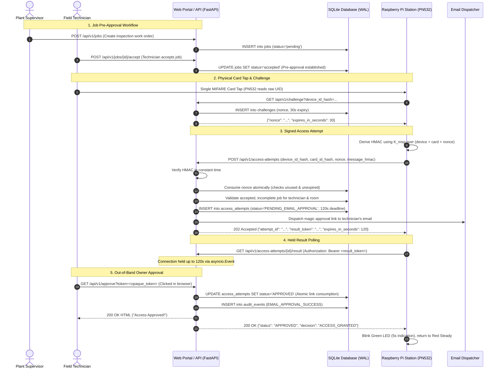

# PermitProof — Industrial IoT Zero-Trust Access & Permit Verification

PermitProof is a fail-safe, cryptographic zero-trust access control and permit-to-work verification platform engineered for mission-critical industrial facilities and server-room perimeters.

It replaces vulnerable physical-only badge systems with a multi-layered verification protocol: physical NFC card taps alone **never** open a room. Every entry attempt requires a single-use server challenge nonce, a genuine HMAC signed by the registered reader station, an active database-backed pre-approval (an accepted work order), and time-bound out-of-band email approval by the card owner.

---

## 📑 Table of Contents

- [1. System Architecture & Zero-Trust Core](#1-system-architecture--zero-trust-core)
- [2. System Boundary & Sequence Flow](#2-system-boundary--sequence-flow)
- [3. Assumptions & Operational Expectations](#3-assumptions--operational-expectations)
- [4. Quick Start & Execution Guide](#4-quick-start--execution-guide)
- [5. Frontend Architecture & User Dashboards](#5-frontend-architecture--user-dashboards)
- [6. Database Architecture & Schema](#6-database-architecture--schema)
- [7. Database & Operational CLI Tools](#7-database--operational-cli-tools)
  - [7.1 Database Seeder (`seed.py`)](#71-database-seeder-seedpy)
  - [7.2 Interactive Management CLI (`manage.py`)](#72-interactive-management-cli-managepy)
  - [7.3 Database Terminal Viewer (`db_viewer.py`)](#73-database-terminal-viewer-db_viewerpy)
  - [7.4 Raspberry Pi Client & LED State Machine (`pi_client.py`)](#74-raspberry-pi-client--led-state-machine-pi_clientpy)
- [8. Security Test Suite & Evidence Matrix](#8-security-test-suite--evidence-matrix)
- [9. Repository Layout](#9-repository-layout)

---

## 1. System Architecture & Zero-Trust Core

PermitProof enforces a strict **fail-closed** zero-trust access control architecture across five defensive layers:

```
┌─────────────────────────────────────────────────────────────────────────────────────────────────────────┐
│                                     FIVE ZERO-TRUST DEFENSE LAYERS                                      │
├───────────────────┬───────────────────┬───────────────────┬──────────────────────┬──────────────────────┤
│ 1. Physical Layer │ 2. Crypto Layer   │ 3. Policy Layer   │ 4. Out-of-Band Layer │ 5. Auditing Layer    │
├───────────────────┼───────────────────┼───────────────────┼──────────────────────┼──────────────────────┤
│ MIFARE Classic    │ Server Nonce (30s)│ Database Pre-Appr │ Emailed Magic Link   │ Tamper-Evident       │
│ NFC Badge UID     │ HMAC-SHA256 Sig   │ Accepted Work     │ 120s Token Deadline  │ SQLite Audit Log     │
│ Read by PN532     │ Bound to Pi & UID │ Order in SQLite   │ Consumed Atomically  │ Privacy Preserved    │
└───────────────────┴───────────────────┴───────────────────┴──────────────────────┴──────────────────────┘
```

1. **Physical Token Layer**: The technician taps a registered MIFARE Classic card on an NFC reader (PN532). The raw card UID bytes are read once.
2. **Cryptographic Authentication Layer**: The Raspberry Pi requests a fresh, single-use random challenge nonce from the server (valid for 30 seconds). It signs the request using HMAC-SHA256 over canonical signing bytes.
3. **Database Pre-Approval Layer**: The server confirms that an incomplete job for this technician and room has been explicitly **accepted** in SQLite. Without an accepted job, the request fails immediately.
4. **Out-of-Band Email Approval Layer**: Upon verifying the HMAC, nonce, and job, the server creates a `PENDING_EMAIL_APPROVAL` record and dispatches a single-use magic link to the technician's registered email address (valid for 120 seconds).
5. **Held Connection & Fail-Closed Terminal State**: The Pi executes a held `GET` request awaiting the decision. When the technician clicks the magic link, SQLite atomically transitions to `APPROVED`, and the Pi signals green. If anything fails, times out, or disconnects, the system fails closed (red indicator).

---

## 2. System Boundary & Sequence Flow



---

## 3. Assumptions & Operational Expectations

### Hardware Assumptions
- **Raspberry Pi**: Model 3B+, 4B, 5, or Pi Zero 2W running Raspberry Pi OS or Linux.
- **NFC Reader**: Adafruit PN532 connected via I2C, SPI, or UART. The card reader extracts the raw UID bytes from a MIFARE Classic card.
- **Visual Status LEDs**: Three GPIO-controlled status LEDs (Red, Yellow, Green):
  - **Red Steady**: Reader idle / perimeter closed.
  - **Yellow Blinking**: Challenge acquired, HMAC verifying, or awaiting email approval.
  - **Green Blinking**: Access granted / room unlocked (5-second indication).
  - **Red Blinking -> Red Steady**: Access rejected or timed out (fail closed).
- **Physical Actuator**: There is no physical lock solenoid in this prototype; the LED indicator represents the physical lock state.

### Cryptographic & Identity Assumptions
- **Static Master Secret**: A 32-byte secret (`MASTER_SECRET`) provisioned into `.env` on both the API server and the Raspberry Pi.
- **Deterministic Key Derivation**: Three distinct keys are derived using HMAC-SHA256 with domain separation strings:
  - `K_device = HMAC-SHA256(master, UTF8("iot-zt:v1:device-token"))`
  - `K_card   = HMAC-SHA256(master, UTF8("iot-zt:v1:card-token"))`
  - `K_msg    = HMAC-SHA256(master, UTF8("iot-zt:v1:access-message"))`
- **Keyed Pseudonymous Identifiers**: The database stores `device_id_hash` and `card_id_hash` (64-character lowercase hexadecimal HMACs). Raw device hostnames and raw card UIDs are never stored in the database or logged in audit trails.
- **Canonical Request Signing**: The HMAC covers:
  `UTF8("access-v1\n" + device_id_hash + "\n" + card_id_hash + "\n" + nonce)`

### Security Disclosures & Known Prototype Trade-offs
1. **Email Scanner Tradeoff**: `GET /api/v1/approve?token=...` approves access immediately on `GET` for demo simplicity. Corporate email scanners that pre-fetch links could inadvertently approve requests. In enterprise production, this should require an authenticated confirmation `POST`.
2. **Shared Master Secret**: Both the API and Pi share the master secret in this prototype. Compromising the Pi would expose the secret. Production deployments should use per-device keys stored in hardware security modules (HSM/TPM) or client certificates (mTLS).
3. **Transport Security**: The prototype runs over HTTP on local LANs (`172.16.30.10:8000`). While HMAC protects against tampering and replay, HTTPS is required for confidentiality of tokens in transit.

---

## 4. Quick Start & Execution Guide

### Prerequisites
- **Python**: Version 3.14+ installed (managed effortlessly via [`uv`](https://docs.astral.sh/uv/)).
- **Node.js**: (Optional) Node.js 18+ and npm if rebuilding frontend source code. The compiled bundle is already tracked in `frontend/dist/`.

---

### Step 1: Clone and Configure Environment

```bash
git clone https://github.com/0xLighted/permit-proof.git
cd permit-proof
```

Create or verify your `.env` file in the project root:

```ini
MASTER_SECRET=abf913629a0e2ef8560e9af135e97fa436f965bc47b80c47e3d5c0b861c6cc52
DATABASE_PATH=permitproof.db
PORT=8000
HOST=0.0.0.0
```

---

### Step 2: Seed the Database

Seed the SQLite database with canonical devices, demonstration users, and pre-approved jobs:

```bash
uv run seed
```

---

### Step 3: Run the Unified Application Server

Start the FastAPI application server, which binds to `0.0.0.0:8000` to serve the REST API and the React frontend simultaneously:

```bash
# On Linux / macOS:
./start.sh
# or: uv run server

# On Windows:
start.bat
# or: uv run server
```

The server automatically detects your network interface and prints accessible LAN addresses:
- **Station Launcher**: `http://<server-ip>:8000/`
- **Technician Terminal**: `http://<server-ip>:8000/technician`
- **Supervisor Console**: `http://<server-ip>:8000/supervisor`
- **Interactive Swagger Docs**: `http://<server-ip>:8000/docs`
- **System Health Check**: `http://<server-ip>:8000/health`

---

### Step 4: Run the Test Suite

Execute the full automated test suite (29 tests covering cryptography, replay prevention, SQLite constraints, and SPA routing):

```bash
uv run pytest
```

---

### Step 5: (Optional) Compile Frontend Assets

The repository includes a pre-built, production-ready distribution in `frontend/dist`. If you modify React components in `frontend/src/`, recompile the bundle:

```bash
# On Linux / macOS:
./build.sh

# On Windows:
build.bat

# Or using npm / uv:
npm run build
uv run build-frontend
```

---

## 5. Frontend Architecture & User Dashboards

The frontend is built using **React 19**, **TypeScript**, and **Vite 6** (configured with Rollup and esbuild for compatibility across modern and enterprise Linux systems).

It follows the visual standards in [`DESIGN.md`](file:///c:/Users/jasmine/OneDrive/Documents/track%203%20-%20dev/DESIGN.md): a high-contrast cyber-industrial aesthetic featuring dark slate backgrounds (`#0f172a`, `#1e293b`), monospace telemetry badges, and real-time state feedback.

```
frontend/src/
├── App.tsx                 # Route coordinator & role switcher
├── main.tsx                # Application mounting root
├── api.ts                  # Backend REST API client adapter
├── types.ts                # TypeScript domain models & request interfaces
├── index.css               # Design tokens, variables & styling
├── pages/
│   ├── Launcher.tsx        # Central role portal & status launcher
│   ├── Supervisor.tsx      # Permit dispatcher & audit monitor
│   └── Technician.tsx      # Work order terminal & simulated card reader
└── components/
    ├── Shell.tsx           # Industrial telemetry navigation shell & header
    ├── JobCard.tsx         # Interactive job card with Accept / Skip actions
    ├── AuthPanel.tsx       # Live card tap & email magic link emulator
    └── AuditLog.tsx        # Cryptographic audit trail stream
```

### Dashboard Pages

#### 1. Station Launcher (`/`)
The central landing portal connecting operators to their designated interface. Provides quick-launch links for field technicians, supervisors, interactive API documentation, and system telemetry health.

#### 2. Technician Terminal (`/technician`)
- **Work Order Management**: View assigned maintenance jobs.
- **Pre-Approval Acceptance**: Technicians must explicitly click **`ACCEPT WORK ORDER`** (or **`SKIP`**). An accepted, incomplete job establishes the SQLite pre-approval record required for door entry.
- **Card-Tap Simulation Panel**: Emulates the physical PN532 MIFARE card tap. Initiates the 3-step challenge/HMAC protocol with live progress indicators.
- **Email Magic-Link Emulator**: Technicians can click the simulated **`OPEN EMAIL APPROVAL LINK ↗`** button, opening `GET /api/v1/approve?token=...` in a new browser tab to approve the pending attempt.
- **Safety Inspection Checklist**: Interactive checklist items (e.g., *Check rack temperature*, *Verify UPS battery status*). Completing all checklist items unlocks the **`COMPLETE WORK ORDER`** button, retiring the pre-approval in SQLite.

#### 3. Supervisor Console (`/supervisor`)
- **Permit Dispatcher Form**: Supervisors can issue new inspection work orders by specifying the room/device, assigning a technician, and composing inspection tasks.
- **Real-Time Revocation**: Instantly revoke active permits with one click. Revoking a job invalidates its pre-approval immediately.
- **Live Audit Stream**: Displays immutable security event records with timestamp, event type, safe reason codes, and privacy-preserved hash prefixes.

---

## 6. Database Architecture & Schema

The storage layer is implemented in [`src/server/db.py`](file:///c:/Users/jasmine/OneDrive/Documents/track%203%20-%20dev/src/server/db.py) using SQLite with Write-Ahead Logging (`WAL` mode) and strict foreign key constraints enabled on every connection (`PRAGMA foreign_keys = ON`).

### Table Schema Summary

```sql
-- 1. Registered Personnel
CREATE TABLE users (
    card_id_hash TEXT PRIMARY KEY,
    full_name TEXT NOT NULL,
    email TEXT NOT NULL,
    role TEXT NOT NULL CHECK(role IN ('supervisor', 'technician')),
    active INTEGER NOT NULL DEFAULT 1
);

-- 2. Registered Reader Stations / Rooms
CREATE TABLE devices (
    device_id_hash TEXT PRIMARY KEY,
    room_id TEXT NOT NULL UNIQUE,
    active INTEGER NOT NULL DEFAULT 1,
    display_name TEXT
);

-- 3. Maintenance Work Orders (Pre-Approvals)
CREATE TABLE jobs (
    job_id TEXT PRIMARY KEY,
    created_at REAL NOT NULL,
    supervisor_id TEXT NOT NULL REFERENCES users(card_id_hash),
    technician_id TEXT NOT NULL REFERENCES users(card_id_hash),
    device_id_hash TEXT NOT NULL REFERENCES devices(device_id_hash),
    tasks_json TEXT NOT NULL DEFAULT '[]',
    status TEXT NOT NULL CHECK(status IN ('pending', 'accepted', 'skipped', 'completed', 'revoked')),
    is_complete INTEGER NOT NULL DEFAULT 0 CHECK((status = 'completed' AND is_complete = 1) OR (status != 'completed' AND is_complete = 0)),
    accepted_at REAL,
    completed_at REAL,
    revoked_at REAL
);

-- 4. Single-Use 30-Second Challenge Nonces
CREATE TABLE challenges (
    nonce TEXT PRIMARY KEY,
    device_id_hash TEXT NOT NULL REFERENCES devices(device_id_hash),
    issued_at REAL NOT NULL,
    expires_at REAL NOT NULL,
    consumed_at REAL
);

-- 5. Access Verification Attempts
CREATE TABLE access_attempts (
    attempt_id TEXT PRIMARY KEY,
    device_id_hash TEXT NOT NULL REFERENCES devices(device_id_hash),
    card_id_hash TEXT NOT NULL REFERENCES users(card_id_hash),
    job_id TEXT NOT NULL REFERENCES jobs(job_id),
    status TEXT NOT NULL CHECK(status IN ('PENDING_EMAIL_APPROVAL', 'APPROVED', 'REJECTED', 'EXPIRED')),
    created_at REAL NOT NULL,
    expires_at REAL NOT NULL,
    decided_at REAL,
    result_token_hash TEXT NOT NULL,
    decision TEXT,
    reason TEXT
);

-- 6. One-Time Emailed Magic Links
CREATE TABLE approval_links (
    token_hash TEXT PRIMARY KEY,
    attempt_id TEXT NOT NULL REFERENCES access_attempts(attempt_id),
    created_at REAL NOT NULL,
    expires_at REAL NOT NULL,
    used_at REAL
);

-- 7. Immutable Audit Trail
CREATE TABLE audit_events (
    event_id INTEGER PRIMARY KEY AUTOINCREMENT,
    timestamp REAL NOT NULL,
    attempt_id TEXT,
    device_hash TEXT,
    card_hash TEXT,
    event_type TEXT NOT NULL,
    outcome TEXT NOT NULL,
    metadata_json TEXT
);
```

---

## 7. Database & Operational CLI Tools

PermitProof includes four dedicated CLI utilities in `src/server/scripts/` to manage, seed, inspect, and test the zero-trust pipeline.

### 7.1 Database Seeder (`seed.py`)

Seeds the SQLite database with canonical demonstration entities derived from `MASTER_SECRET`.

```bash
uv run seed
```

#### Sample Output:
```text
================================================================================
  PERMITPROOF STAGE 2 DATABASE SEEDING
================================================================================
Database Path: permitproof.db
[+] Device registered: Server Room Alpha Reader
    Canonical Pi ID: pi-server-room-001
    Room ID        : server-room-alpha
    Device Hash    : a9796aad4225ffe673d0cfd1fbe57fa291888671cde4e0175426e6430363c805
[+] Device registered: Charlie Pi Reader Station
    Canonical Pi ID: charlie-pi
    Room ID        : server-room-charlie
    Device Hash    : ada817ecbcffbe74aeea7ff8e7b2b79ed466af482fbb60af3c7c8e457caf503e
[+] User registered: Alice Supervisor (Role: supervisor)
[+] User registered: Jasmine Zurayn (Role: technician)
    Card Hash: 0b1d30c5e7b308e4ad283e390cbf0c8d76db84eb430c563604ea389772ee571d
[+] Job created & accepted: job-seed-alpha (Room: server-room-alpha)
    Pre-approval is ACTIVE and ready for physical card tap!
================================================================================
```

---

### 7.2 Interactive Management CLI (`manage.py`)

A comprehensive administrative tool supporting both an interactive console menu and direct CLI subcommands for automated scripting.

#### Interactive Mode:
```bash
uv run manage
```

```text
================================================================================
  PERMITPROOF STAGE 2 DATABASE MANAGEMENT CONSOLE
================================================================================
  Database: permitproof.db
  Active Master Secret: [CONFIGURED]
================================================================================

--- Users & Cards ---
  [1] List all registered users
  [2] Register new user (from raw UID or computed hash)
  [3] Deactivate / delete user

--- Devices & Readers ---
  [4] List registered Raspberry Pi devices
  [5] Register new device (from canonical Pi ID or hash)
  [6] Deactivate / delete device

--- Pre-Approval Jobs ---
  [7] List maintenance work orders
  [8] Create new job (Supervisor -> Technician)
  [9] Accept job (Technician pre-approval)
  [10] Mark job complete
  [11] Revoke job

--- Diagnostics ---
  [s] Re-seed database with default fixtures
  [0] Exit
================================================================================
Select option:
```

#### Direct CLI Subcommands:

##### 1. List Registered Personnel:
```bash
uv run python -m server.scripts.manage users list
```
```text
--- Registered Users (2) ---
Role         Active   Full Name            Email                          Card Hash (Prefix)
-------------------------------------------------------------------------------------
supervisor   YES      Alice Supervisor     supervisor@plant.internal      4f981e4b830d12ac...
technician   YES      Jasmine Zurayn       j.zurayn@plant.internal        0b1d30c5e7b308e4...
```

##### 2. Register a Card by Raw NFC UID:
Computes the keyed `card_id_hash` automatically using `K_card`:
```bash
uv run python -m server.scripts.manage users add \
  --uid-hex "04:A2:B3:C4:D5:E6:F7" \
  --name "Marcus Vance" \
  --email "m.vance@plant.internal" \
  --role "technician"
```

##### 3. Register a Device by Canonical Hostname:
Computes the keyed `device_id_hash` automatically using `K_device`:
```bash
uv run python -m server.scripts.manage devices add \
  --canonical-id "pi-server-room-bravo" \
  --room "server-room-bravo" \
  --name "Server Room Bravo Reader"
```

##### 4. Create and Accept a Pre-Approval Job:
```bash
# Create job
uv run python -m server.scripts.manage jobs create \
  --supervisor "<supervisor-card-hash>" \
  --tech "<technician-card-hash>" \
  --device "<device-hash>" \
  --tasks "Inspect HVAC coolant" "Calibrate sensors"

# Accept job (Technician Pre-Approval)
uv run python -m server.scripts.manage jobs accept --job-id "<job-id>" --tech "<technician-card-hash>"
```

---

### 7.3 Database Terminal Viewer (`db_viewer.py`)

An interactive curses-style terminal navigator for browsing SQLite tables, scrolling through records, and inspecting full JSON metadata without leaving the terminal.

```bash
uv run view-db
```

#### Navigation Hotkeys:
- `TAB` / `SHIFT+TAB`: Switch between database tables (`users`, `devices`, `jobs`, `challenges`, `access_attempts`, `approval_links`, `audit_events`).
- `↑` / `↓`: Scroll rows in the table.
- `ENTER`: Open row inspector showing full multiline details and formatted JSON.
- `q`: Quit viewer.

#### Example Terminal View:
```text
================================================================================
  PERMITPROOF DATABASE VIEWER | Table: jobs [3/7] | Rows: 2
================================================================================
  [0] ID: job-seed-alpha  | Room: server-room-alpha   | Status: accepted   | Complete: NO
  [1] ID: job-seed-charlie| Room: server-room-charlie | Status: accepted   | Complete: NO
--------------------------------------------------------------------------------
  Use [TAB] to switch tables, [UP/DOWN] to select, [ENTER] to inspect, [q] to exit
================================================================================
```

---

### 7.4 Raspberry Pi Client & LED State Machine (`pi_client.py`)

A turnkey hardware client for the Raspberry Pi. Connects to an Adafruit PN532 reader, controls status LEDs, and drives the 3-step zero-trust HTTP protocol. It also includes an interactive simulated mode for hardware-free demonstrations.

```bash
# Run against the LAN API server
uv run pi-client --server http://172.16.30.10:8000 --device-id pi-server-room-001
```

#### Interactive Simulation Mode:
```bash
uv run pi-client --server http://172.16.30.10:8000 --interactive
```

#### Sample Terminal Output During Access Tap:
```text
===========================================================================
  PERMITPROOF PI ACCESS SEQUENCE INITIATED
===========================================================================
Device ID          : pi-server-room-001
Device Hash (K_dev): a9796aad4225ffe6...0363c805
Raw Card UID       : 04a2b3c4d5e6f7
Card Hash (K_card) : 0b1d30c5e7b308e4...72ee571d
API Target Host    : http://172.16.30.10:8000
[◐ LED: YELLOW BLINKING] State: CHALLENGE_PENDING — Verification in progress...
[1/3] Challenge Nonce Acquired: eK_9zL1m0vPQwA7 (Expires in 30s)
[◐ LED: YELLOW BLINKING] State: VERIFYING — Computing HMAC signature...
[2/3] Access Attempt Accepted (202): ID=6f84b12c-982a-43d9-9f72-731bfa283d09
      Status: PENDING_EMAIL_APPROVAL (Deadline: 120s)
[◐ LED: YELLOW BLINKING] State: AWAITING_EMAIL — Holding connection for email approval...
[3/3] Holding connection awaiting technician email magic-link approval...

[+] Final Result: APPROVED! Decision: ACCESS_GRANTED
[● LED: GREEN BLINKING] State: APPROVED — Access granted! Room unlocked.
[● LED: RED STEADY] Reader is IDLE / CLOSED. Waiting for card tap...
```

---

## 8. Security Test Suite & Evidence Matrix

PermitProof includes an automated test suite verifying all 11 security attack and defense scenarios documented in `STAGE2_HANDOFF.md`:

```bash
uv run pytest
```

| Security Scenario Tested | Attack Vector Simulated | System Defense & Expected Outcome | Test Function |
| :--- | :--- | :--- | :--- |
| **1. Legitimate Flow** | Valid card tap with accepted job | `202 Accepted`, magic link approved, `ACCESS_GRANTED` | `test_valid_access_attempt` |
| **2. Missing Pre-Approval** | Valid card tapped with completed/pending job | Denied before email dispatch (`403 Forbidden`) | `test_no_accepted_job_rejected` |
| **3. Tampered Payload** | Altered byte in `card_id_hash` or `nonce` | Constant-time HMAC check fails (`401 Unauthorized`) | `test_tampered_hmac_rejected` |
| **4. Unknown Device** | Unregistered reader station | Unknown device rejected (`403 Forbidden`) | `test_challenge_unregistered_device` |
| **5. Replay Attack** | Replaying identical signed payload | Nonce consumed atomically (`409 Conflict`) | `test_replay_attack_rejected` |
| **6. Expired Nonce** | Submitting POST after 30 seconds | Expired challenge rejected (`400 Bad Request`) | `test_expired_nonce_rejected` |
| **7. Device Nonce Stealing** | Using nonce issued for another room | Nonce-device mismatch rejected (`403 Forbidden`) | `test_nonce_device_mismatch` |
| **8. Unregistered Card** | Card UID not mapped in `users` | Unregistered card rejected (`403 Forbidden`) | `test_unregistered_card_rejected` |
| **9. Magic Link Re-use** | Clicking emailed approval link twice | One-time token rejected (`400 Bad Request`, `ALREADY_USED`) | `test_email_token_reuse_rejected` |
| **10. Forged Result Poll** | Polling attempt result without Bearer token | Result token unauthorized (`401 Unauthorized`) | `test_held_result_unauthorized_token` |
| **11. Secret Privacy** | Inspecting audit log for credentials | Master keys, raw UIDs, and tokens are scrubbed | `test_audit_events_endpoint_and_token_privacy` |

---

## 9. Repository Layout

```text
permit-proof/
├── DESIGN.md                          # Industrial UI/UX style tokens & design principles
├── STAGE2_HANDOFF.md                  # Stage 2 specification & frozen architectural contract
├── pyproject.toml                     # Python package metadata, dependencies & CLI entrypoints
├── package.json                       # Monorepo root scripts & workspace configuration
├── build.sh                           # Linux / macOS frontend build script
├── build.bat                          # Windows frontend build script
├── start.sh                           # Linux / macOS application server launch script
├── start.bat                          # Windows application server launch script
│
├── src/server/                        # Backend Application Server & Security Core
│   ├── __init__.py                    # Exports app, db, main
│   ├── main.py                        # FastAPI endpoints, SPA serving & held-connection handler
│   ├── crypto.py                      # HMAC-SHA256 derivation, hashing & constant-time validation
│   ├── db.py                          # SQLite engine (WAL mode, foreign keys, transactions)
│   ├── schemas.py                     # Pydantic request/response validation schemas
│   ├── email_service.py               # Out-of-band magic link dispatcher
│   └── scripts/                       # Operational & Administrative CLI Tools
│       ├── seed.py                    # Database fixtures seeder (uv run seed)
│       ├── manage.py                  # Interactive CRUD administration (uv run manage)
│       ├── db_viewer.py               # Terminal database browser (uv run view-db)
│       ├── pi_client.py               # Raspberry Pi NFC client & LED runner (uv run pi-client)
│       └── build_frontend.py          # Python frontend compiler (uv run build-frontend)
│
├── frontend/                          # React 19 + TypeScript + Vite Industrial Web Portal
│   ├── package.json                   # Frontend dependencies & scripts
│   ├── vite.config.ts                 # Vite bundler configuration & backend proxy
│   ├── index.html                     # Application HTML entrypoint
│   ├── dist/                          # Prebuilt production bundle (tracked for zero-dependency run)
│   └── src/                           # React UI source code (App, pages, components, tokens)
│
└── test/                              # Automated Verification & Defense Test Suite
    ├── test_api.py                    # 19 tests: Crypto, replay prevention, held GET, audit privacy
    ├── test_cli.py                    # 4 tests: CLI CRUD commands & database viewer
    └── test_frontend_bridge.py        # 6 tests: UI state bridges, checklist, SPA endpoints
```

---

## 🔒 Security Best Practice Note for Hackathon Evaluators

In accordance with **NIST SP 800-207 (Zero Trust Architecture)**, this prototype treats perimeter network presence as untrusted. No single credential (physical card UID, network IP, or valid job pre-approval) can grant access in isolation. The system mandates multi-party agreement between the reader hardware, the server-side authorization database, and the authenticated card owner via an out-of-band communication channel.
